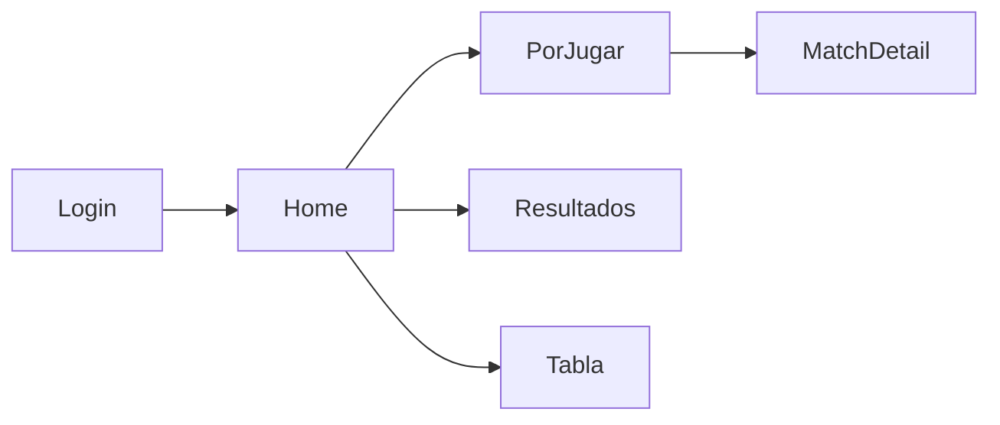

# Survivor App

Aplicación Flutter para el modo “Survival La Liga”, donde los usuarios compiten por vidas, posición, pozo acumulado y supervivencia.

## Tabla de contenidos

- [Demo / Capturas](#demo--capturas)  
- [Características](#características)  
- [Arquitectura / Estructura](#arquitectura--estructura)  
- [Instalación](#instalación)  
- [Uso / ejecución](#uso--ejecución)  
- [Flujos / navegación](#flujos--navegación)  
- [Dependencias principales](#dependencias-principales)  
- [Assets / íconos / recursos](#assets--íconos--recursos)  
- [Pruebas](#pruebas)  
- [Contribución](#contribución)  
- [Licencia](#licencia)  

---

## Demo / Capturas

_(Agregá aquí imágenes de la app)_

## Características

- Modo “Survival La Liga”  
- Vidas, posición, pozo acumulado y número de sobrevivientes  
- Listado de jornadas y partidos  
- Navegación entre pestañas: Por jugar / Resultados / Tabla  
- Íconos personalizados y diseño UI moderno  

## Arquitectura / Estructura

La estructura principal del proyecto es:

```
lib/
 ├── main.dart
 ├── screens/
 ├── widgets/
 ├── models/
 ├── services/
 ├── providers/ (o /bloc/ /state/)
 └── utils/
assets/
 ├── icons/
 └── images/
docs/ (opcional)
```

### Navegación básica

El flujo de navegación es:

- Login → Home  
- En Home: pestañas “Por jugar”, “Resultados”, “Tabla”  
- Cada pestaña muestra su contenido  
- Al tocar un partido, ir a pantalla de detalle  

## Instalación

```bash
git clone https://github.com/FacundoMaciel/survivor-app.git
cd survivor-app
flutter pub get
```

(Agregá aquí si necesitás configurar claves, variantes, etc.)

## Uso / ejecución

Para correr en dispositivo/emulador:

```bash
flutter run
```

Si tenés configuraciones especiales (por ambientes), describilas.

## Flujos / navegación



Explicá qué acciones lleva cada pantalla.

## Dependencias principales

| Paquete         | Uso principal                        |
|-----------------|--------------------------------------|
| flutter_svg     | Renderizar íconos SVG                |
| http / dio      | Solicitudes HTTP a API               |
| provider / bloc | Manejo de estado                     |
| shared_preferences | Almacenamiento local              |
| ...             | ...                                  |

## Assets / íconos / recursos

Los íconos SVG se encuentran en `assets/icons/`.  
Se usa `app_icons.dart` para referenciarlos.  
Ejemplo de uso:

```dart
SvgPicture.asset(AppIcons.byPenka, width: 28, height: 28);
```

## Pruebas

Para ejecutar test:

```bash
flutter test
```

(Cuando agregues tests, agregá ejemplos aquí)

## Contribución

1. Hacé un fork  
2. Creá una feature branch (`feature/nombre`)  
3. Realizá commits claros  
4. Abrí un pull request  

## Licencia

Este proyecto está bajo la licencia MIT — ver archivo `LICENSE` para más detalles.  
